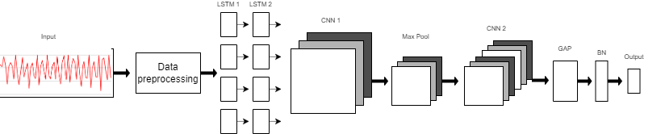

# Human Activity Recognition (HAR) Using LSTM and CNN

Human Activity Recognition (HAR) is a method for recognizing human activities through Artificial Intelligence (AI) using raw data generated by activity recording devices, such as smartwatches. These devices are equipped with sensors like accelerometers, gyroscopes, and magnetometers that capture the signals generated when a person performs an action. HAR has several applications, including assisting the sick and disabled and enhancing fields like gaming, which rely on analyzing motor skills.

In this project, we focus on recognizing human activities using mobile sensors. Specifically, we are using raw accelerometer data collected from a mobile device worn around a person’s waist.

## Activities to be Predicted

The activities we will predict using the model are:

- Downstairs
- Jogging
- Sitting
- Standing
- Upstairs
- Walking

## Dataset

The dataset used for this project is **WISDM_ar_v1.1_raw.txt**, which contains raw data collected by an accelerometer from a mobile device worn by a person. The data collection process was supervised to ensure high-quality data. You can download the dataset from the provided link below:

- [Download WISDM Dataset](https://www.cis.fordham.edu/wisdm/dataset.php)

## Model Architecture

We use a hybrid model combining Long Short-Term Memory (LSTM) and Convolutional Neural Networks (CNN) for activity recognition. The model consists of 8 layers:

1. **Preprocessing Layer**: The raw data is fed into the model after preprocessing.
2. **LSTM Layers**: The first two layers are LSTM with 32 neurons each, using the ReLU activation function.
3. **Reshaping Layer**: The output from the LSTM layers, which has 3 dimensions (samples, time steps, input dimension), is reshaped to 4 dimensions (samples, 1, time steps, input dimension) to be suitable for the CNN layers.
4. **CNN Layers**: 
    - The first CNN layer has 64 neurons.
    - The second CNN layer has 128 neurons.
5. **Max-Pooling Layer**: A Max-Pooling layer is added between the first and second CNN layers to perform the downsampling operation.
6. **Global Average Pooling (GAP) Layer**: This layer converts multi-dimensional feature maps into one-dimensional feature vectors, reducing the model parameters and enhancing computational efficiency.
7. **Batch Normalization Layer (BN)**: This layer normalizes the inputs of each batch, ensuring the stability and convergence of the model.
8. **Output Layer**: A fully connected Dense layer with 6 neurons representing the probability of the sample belonging to one of the 6 classes (activities) using a softmax classifier.

## Model Performance

After training, the model achieved the following performance metrics:

- **Accuracy**: 98.02%
- **Loss**: 0.58%
- **F1 Score (Training)**: 0.96

